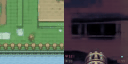
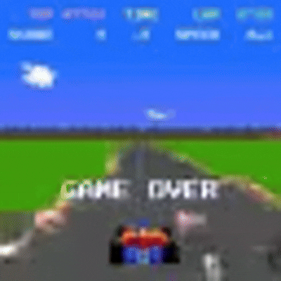

# Pixie
An attempt at implementing a Genie clone on the tinyworlds dataset.

  
  
  

## Overview
Pixie is inspired by Google Deepmind's Genie architecture. It consists of a video tokenizer, action tokenizer, and a dynamics model that all use a spatio-temporal transformer backbone. 
### Video Tokenizer
For each input frame, the video tokenizer splits it into patches, converts each patch into an embedding using 2D convolutions, and then passes these embeddings into an ST-Transformer that outputs continuous embeddings. These continuous embeddings are then discretized using finite scalar quantization to make training easier. This pass is the encoder half of the video tokenizer. The decoder half takes these discrete embeddings as input and puts them through an ST-Transformer. These output embeddings are then put through a conv transpose to get back to pixel space and produce the reconstructed image.

### Action Tokenizer
The encoder for the action tokenizer takes a sequence of frames and predicts discrete action tokens between frames. The decoder then takes input frames x_1, x_2, ..., x_(T-1) and discrete action tokens a_1, a_2, ..., a_(T-1) and predicts frames y_2, y_3, ..., y_T. The encoder has the same architecture as the encoder for the video tokenizer. The decoder, however, doesn't take in discretized embeddings but rather frames. So the decoder takes in patchified frames, converts these patches to embeddings and then puts them through an ST-Transformer that is conditioned on the discrete action tokens. The conditioned output embeddings are then converted back into pixel space using conv transposes.

### Dynamics Model
The dynamics model uses the frozen video tokenizer and action tokenizer encoders to produce discrete video and action tokens. The decoder takes these discrete tokens as input to an ST-Transformer who's outputs are video tokens that are then fed into the video tokenizers decoder to produce the next frame.

### Data
This is a small scale experiment that I followed out of curiousity so it is not meant to be anywhere near as powerful as the original genie by Google Deepmind. The only games in the training data are doom, sonic, zelda, pong, and pole position. These is no reason more games cannot be included, but it would significantly increase training times.

### Future work
I have seen some generative world models have used diffusion based generation instead of autoregressive for frames and this is something that could be included in follow up work. I could also try to get inference to work in real time (say around 24 FPS) on a single GPU using short cut forcing techniques that I have seen in recent papers such as DreamerV4.
